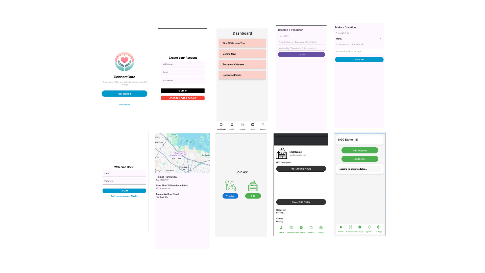

# 🌱 ConnectCare — Connecting NGOs and Volunteers 

> “Because kindness should never be out of reach.”

---

## 📌 About the Project

**ConnectCare** is a mobile application aimed at leveraging technology to solve one or more of the United Nations’ **17 Sustainable Development Goals (SDGs)**.

This project addresses the following SDGs:

- **#3 Good Health and Well-being** 🩺  
- **#10 Reduced Inequalities** 🤝  
- **#12 Responsible Consumption and Production** ♻️  

By enabling individuals to **donate unused medicines, clothes, and other essential supplies**, ConnectCare creates a bridge between **donors** and **people in need**, fostering a culture of care and sustainability.

---

## 🚀 Features

- 📦 Upload donation items with images & categories  
- 🗂️ View and browse donations from others  
- 📍 Nearby NGO Finder: Discover and connect with verified NGOs around you using location services. 
- 🧾 Organized, clean interface for easy navigation  
- 🔄 Role switch between donor & receiver
- 🔒 Google Sign-In: Secure and easy login/signup using Google accounts.
- 💸 Google Pay Integration: Make optional monetary contributions or support causes through direct payments.
- 💬 Collaboration & Chat (Upcoming): Communicate directly with NGOs or beneficiaries via secure in-app messaging.
- 🧾 Donation Tracker: Monitor your donation history and impact through a user-friendly dashboard.

---

## 🎯 Project Goals

- Reduce waste and promote **reuse of essentials**
- Provide a **lifeline for underserved communities**
- Empower people to contribute to society easily and impactfully
- Scale this to NGOs, shelters, and local donation drives

---

## 🛠️ Tech Stack

- **Frontend**: Android (Java, Kotlin, XML)
- **Backend**: Firebase / SQLite / REST API (to be integrated)
- **Design**: Material UI
- **Tools**: Android Studio, GitHub, Figma (for UI)
- **Payments**: Google Pay API
- **Authentication**: Firebase Auth with Google Sign-In
---

## 📸 Screenshots

  

---

## 🧠 Future Enhancements

- 🔍 Smart Matching: AI-based recommendation of nearby NGOs based on donation type
- 📡 Geo-fencing Alerts: Notify users when nearby shelters or NGOs need help
- 🛡️ Item Verification & Expiry Tracking
- 📈 Analytics Dashboard: Visual impact summary (items donated, NGOs helped, CO2 saved)
- 🌐 Multi-language Support for regional inclusivity

---

## 📜 License

This project is licensed under the MIT License.

